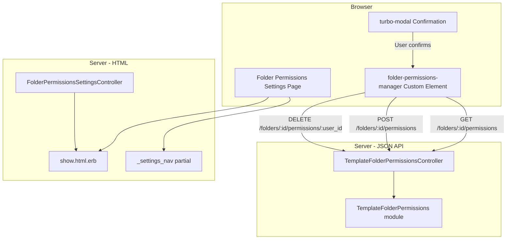
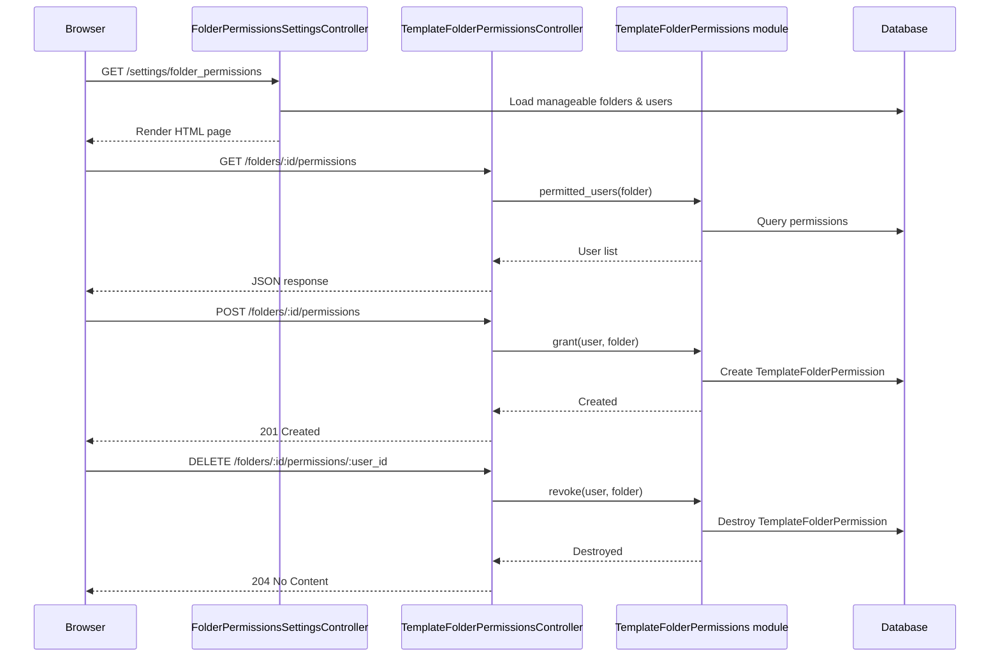

# Design Document: Folder Permissions Settings UI

## Overview

This document describes the technical design for a dedicated settings page that allows folder owners and admins to manage folder view permissions through a web-based interface. The backend permission system already exists (see `folder-view-permissions` spec); this feature provides the server-rendered UI layer (ERB templates with Turbo and custom elements) that consumes the existing `GET/POST/DELETE /folders/:folder_id/permissions` endpoints.

The design follows the established settings page patterns observed in `NotificationsSettingsController`, `PersonalizationSettingsController`, and other settings pages: a flex wrapper layout with the shared `_settings_nav` partial on the left, a centered `max-w-xl` content area, and a spacer `div` on the right for balanced centering.

### Key Design Decisions

**New controller for the settings page**: A `FolderPermissionsSettingsController` provides the HTML page (`show` action). It is separate from the existing `TemplateFolderPermissionsController` which serves the JSON API. This separation keeps the API controller pure (JSON-only) and the settings page controller focused on rendering HTML.

**Custom element for async interactions**: A new `<folder-permissions-manager>` custom element handles fetching the permitted users list, granting access, and revoking access via the existing JSON API—without full page reloads. This matches the app's pattern of using lightweight custom elements (like `<submit-form>`, `<folder-autocomplete>`) rather than heavy frameworks for interactivity.

**Server-rendered folder selector**: The folder list is rendered server-side at page load (in the `show` action) as a `<select>` element. When the user changes the selection, the custom element fetches the permissions for the selected folder via the JSON API. This avoids an additional endpoint and keeps the initial page load fast.

**Turbo Frame for confirmation modal**: The revoke confirmation dialog uses the existing `turbo-modal` pattern already present in the application layout (`<turbo-frame id="modal">`), keeping UX consistent with other destructive actions in the app.

---

## Architecture



The settings page is purely a presentation layer. All permission logic flows through the existing `TemplateFolderPermissions` service module via the JSON API controller.

---

## Components and Interfaces

### 1. `FolderPermissionsSettingsController`

A new controller that renders the HTML settings page. Located at `app/controllers/folder_permissions_settings_controller.rb`.

```ruby
# app/controllers/folder_permissions_settings_controller.rb
class FolderPermissionsSettingsController < ApplicationController
  skip_authorization_check

  before_action :authorize_access

  def show
    @folders = manageable_folders
    @users = current_account.users.active.where.not(role: 'integration').order(:last_name, :first_name)
  end

  private

  def authorize_access
    return if current_user.role == User::ADMIN_ROLE
    return if current_account.template_folders.active.exists?(author_id: current_user.id)

    redirect_to root_path, alert: I18n.t('not_authorized')
  end

  def manageable_folders
    scope = current_account.template_folders.active.order(:name)

    if current_user.role == User::ADMIN_ROLE
      scope
    else
      scope.where(author_id: current_user.id)
    end
  end
end
```

### 2. Settings Page View (`show.html.erb`)

Located at `app/views/folder_permissions_settings/show.html.erb`. Follows the standard three-column flex layout.

```erb
<div class="flex flex-wrap space-y-4 md:flex-nowrap md:space-y-0">
  <%= render 'shared/settings_nav' %>
  <div class="flex-grow max-w-xl mx-auto">
    <h1 class="text-4xl font-bold mb-4">
      <%= t('folder_permissions') %>
    </h1>

    <% if @folders.any? %>
      <folder-permissions-manager data-csrf="<%= form_authenticity_token %>">
        <!-- Folder Selector -->
        <div class="form-control w-full mb-6">
          <label class="label" for="folder_select">
            <span class="label-text font-medium"><%= t('select_folder') %></span>
          </label>
          <select id="folder_select" class="select select-bordered w-full"
                  aria-label="<%= t('select_folder') %>">
            <option value="" disabled selected><%= t('choose_a_folder') %></option>
            <% @folders.each do |folder| %>
              <option value="<%= folder.id %>"
                      data-owner-id="<%= folder.author_id %>">
                <%= truncate(folder.full_name, length: 100) %>
              </option>
            <% end %>
          </select>
        </div>

        <!-- Permissions Panel (shown after folder selection) -->
        <div id="permissions_panel" class="hidden">
          <!-- User List -->
          <div class="mb-6">
            <h2 class="text-2xl font-bold mb-3"><%= t('permitted_users') %></h2>
            <div id="unrestricted_message" class="hidden alert alert-info">
              <span><%= t('all_account_members_have_access') %></span>
            </div>
            <div id="loading_indicator" class="hidden flex justify-center py-4">
              <span class="loading loading-spinner loading-md"></span>
            </div>
            <div id="error_message" class="hidden alert alert-error mb-4">
              <span></span>
            </div>
            <div id="users_table_container" class="overflow-y-auto max-h-[400px]">
              <table class="table w-full" role="grid">
                <thead>
                  <tr>
                    <th scope="col"><%= t('name') %></th>
                    <th scope="col"><%= t('email') %></th>
                    <th scope="col"><%= t('role') %></th>
                    <th scope="col"><span class="sr-only"><%= t('actions') %></span></th>
                  </tr>
                </thead>
                <tbody id="users_list">
                </tbody>
              </table>
            </div>
          </div>

          <!-- Grant Form -->
          <div id="grant_section" class="border-t pt-4">
            <h2 class="text-2xl font-bold mb-3"><%= t('grant_access') %></h2>
            <div id="no_users_message" class="hidden text-sm text-base-content/70">
              <%= t('no_additional_users_available') %>
            </div>
            <div id="grant_form_container">
              <div class="flex gap-2 items-end">
                <div class="form-control flex-grow">
                  <label class="label" for="user_select">
                    <span class="label-text"><%= t('select_user') %></span>
                  </label>
                  <select id="user_select" class="select select-bordered w-full"
                          aria-label="<%= t('select_user_to_grant_access') %>">
                    <option value="" disabled selected><%= t('choose_a_user') %></option>
                  </select>
                </div>
                <button id="grant_button" type="button" class="btn btn-primary"
                        disabled aria-label="<%= t('grant_access') %>">
                  <%= t('grant') %>
                </button>
              </div>
              <div id="grant_error" class="hidden text-error text-sm mt-1"></div>
            </div>
          </div>
        </div>

        <!-- Status Message -->
        <div id="status_message" class="hidden toast toast-end toast-bottom" role="status" aria-live="polite">
          <div class="alert">
            <span></span>
          </div>
        </div>
      </folder-permissions-manager>
    <% else %>
      <p class="text-base-content/70">
        <%= t('no_folders_available_for_permission_management') %>
      </p>
    <% end %>
  </div>
  <div class="w-0 md:w-52"></div>
</div>
```

### 3. `<folder-permissions-manager>` Custom Element

A new custom element at `app/javascript/elements/folder_permissions_manager.js` that manages all client-side interactions.

```javascript
// app/javascript/elements/folder_permissions_manager.js
export default class extends HTMLElement {
  connectedCallback () {
    this.folderSelect = this.querySelector('#folder_select')
    this.permissionsPanel = this.querySelector('#permissions_panel')
    this.usersList = this.querySelector('#users_list')
    this.userSelect = this.querySelector('#user_select')
    this.grantButton = this.querySelector('#grant_button')
    this.loadingIndicator = this.querySelector('#loading_indicator')
    this.errorMessage = this.querySelector('#error_message')
    this.unrestrictedMessage = this.querySelector('#unrestricted_message')
    this.noUsersMessage = this.querySelector('#no_users_message')
    this.grantFormContainer = this.querySelector('#grant_form_container')
    this.grantError = this.querySelector('#grant_error')
    this.statusMessage = this.querySelector('#status_message')
    this.usersTableContainer = this.querySelector('#users_table_container')

    this.allUsers = JSON.parse(this.dataset.users || '[]')
    this.currentUserId = null
    this.selectedFolderId = null
    this.selectedFolderOwnerId = null
    this.permittedUsers = []
    this.isUnrestricted = false

    this.folderSelect.addEventListener('change', this.onFolderChange)
    this.grantButton.addEventListener('click', this.onGrant)
    this.userSelect.addEventListener('change', this.onUserSelectChange)
  }

  disconnectedCallback () {
    this.folderSelect.removeEventListener('change', this.onFolderChange)
    this.grantButton.removeEventListener('click', this.onGrant)
    this.userSelect.removeEventListener('change', this.onUserSelectChange)
  }

  onFolderChange = async () => {
    const option = this.folderSelect.selectedOptions[0]
    this.selectedFolderId = option.value
    this.selectedFolderOwnerId = parseInt(option.dataset.ownerId)

    this.permissionsPanel.classList.remove('hidden')
    await this.loadPermissions()
  }

  loadPermissions = async () => {
    this.showLoading(true)
    this.hideError()
    this.usersList.innerHTML = ''
    this.unrestrictedMessage.classList.add('hidden')

    try {
      const resp = await fetch(`/folders/${this.selectedFolderId}/permissions`, {
        headers: { 'Accept': 'application/json' }
      })

      if (!resp.ok) throw new Error('Failed to load permissions')

      const users = await resp.json()
      this.permittedUsers = users
      this.renderUserList(users)
      this.updateGrantForm(users)
    } catch (e) {
      this.showError(e.message)
    } finally {
      this.showLoading(false)
    }
  }

  renderUserList = (users) => {
    // Detect unrestricted: if all account users are returned,
    // show the unrestricted message
    if (users.length === this.allUsers.length && !this.hasExplicitPermissions()) {
      this.unrestrictedMessage.classList.remove('hidden')
      this.usersTableContainer.classList.add('hidden')
    } else {
      this.unrestrictedMessage.classList.add('hidden')
      this.usersTableContainer.classList.remove('hidden')
    }

    this.usersList.innerHTML = ''
    const sorted = [...users].sort((a, b) =>
      (a.last_name || '').localeCompare(b.last_name || '') ||
      (a.first_name || '').localeCompare(b.first_name || '')
    )

    sorted.forEach(user => {
      const tr = document.createElement('tr')
      const isOwner = user.id === this.selectedFolderOwnerId
      const isAdmin = user.role === 'admin'
      const canRevoke = !isOwner && !isAdmin

      tr.id = `user_row_${user.id}`
      tr.innerHTML = `
        <td>
          ${this.escapeHtml(user.first_name || '')} ${this.escapeHtml(user.last_name || '')}
          ${isOwner ? '<span class="badge badge-sm badge-outline ml-1">Owner</span>' : ''}
          ${isAdmin ? '<span class="badge badge-sm badge-outline ml-1">Admin</span>' : ''}
        </td>
        <td>${this.escapeHtml(user.email)}</td>
        <td class="capitalize">${this.escapeHtml(user.role)}</td>
        <td>
          ${canRevoke ? `<button type="button" class="btn btn-xs btn-error btn-outline"
            aria-label="Revoke access for ${this.escapeHtml(user.email)}"
            data-user-id="${user.id}"
            data-user-name="${this.escapeHtml(user.first_name || '')} ${this.escapeHtml(user.last_name || '')}">
            Revoke
          </button>` : ''}
        </td>
      `

      const revokeBtn = tr.querySelector('[data-user-id]')
      if (revokeBtn) {
        revokeBtn.addEventListener('click', () => this.onRevokeClick(user))
      }

      this.usersList.appendChild(tr)
    })
  }

  onRevokeClick = (user) => {
    const name = `${user.first_name || ''} ${user.last_name || ''}`.trim() || user.email
    if (!confirm(`Are you sure you want to revoke access for ${name}?`)) return

    this.revokeAccess(user)
  }

  revokeAccess = async (user) => {
    this.setFormDisabled(true)

    try {
      const resp = await fetch(`/folders/${this.selectedFolderId}/permissions/${user.id}`, {
        method: 'DELETE',
        headers: {
          'X-CSRF-Token': this.dataset.csrf,
          'Accept': 'application/json'
        }
      })

      if (!resp.ok) throw new Error('Failed to revoke access')

      const row = this.querySelector(`#user_row_${user.id}`)
      if (row) row.remove()

      this.permittedUsers = this.permittedUsers.filter(u => u.id !== user.id)
      this.updateGrantForm(this.permittedUsers)
      this.showStatus('Access revoked successfully')
    } catch (e) {
      this.showStatus('Failed to revoke access', true)
    } finally {
      this.setFormDisabled(false)
    }
  }

  onUserSelectChange = () => {
    this.grantButton.disabled = !this.userSelect.value
  }

  onGrant = async () => {
    const userId = this.userSelect.value
    if (!userId) {
      this.grantError.textContent = 'Please select a user'
      this.grantError.classList.remove('hidden')
      return
    }

    this.grantError.classList.add('hidden')
    this.setFormDisabled(true)

    try {
      const resp = await fetch(`/folders/${this.selectedFolderId}/permissions`, {
        method: 'POST',
        headers: {
          'Content-Type': 'application/json',
          'X-CSRF-Token': this.dataset.csrf,
          'Accept': 'application/json'
        },
        body: JSON.stringify({ user_id: userId })
      })

      if (!resp.ok) {
        const data = await resp.json().catch(() => ({}))
        throw new Error(data.error || 'Failed to grant access')
      }

      await this.loadPermissions()
      this.showStatus('Access granted successfully')
    } catch (e) {
      this.grantError.textContent = e.message
      this.grantError.classList.remove('hidden')
      this.showStatus('Failed to grant access', true)
    } finally {
      this.setFormDisabled(false)
    }
  }

  updateGrantForm = (permittedUsers) => {
    const permittedIds = new Set(permittedUsers.map(u => u.id))
    const available = this.allUsers.filter(u => !permittedIds.has(u.id))

    if (available.length === 0) {
      this.noUsersMessage.classList.remove('hidden')
      this.grantFormContainer.classList.add('hidden')
    } else {
      this.noUsersMessage.classList.add('hidden')
      this.grantFormContainer.classList.remove('hidden')

      this.userSelect.innerHTML = '<option value="" disabled selected>Choose a user</option>'
      available.forEach(user => {
        const opt = document.createElement('option')
        opt.value = user.id
        opt.textContent = `${user.first_name || ''} ${user.last_name || ''} (${user.email})`.trim()
        this.userSelect.appendChild(opt)
      })
    }

    this.grantButton.disabled = true
    this.userSelect.value = ''
  }

  showLoading = (show) => {
    this.loadingIndicator.classList.toggle('hidden', !show)
    this.usersTableContainer.classList.toggle('hidden', show)
  }

  showError = (message) => {
    this.errorMessage.querySelector('span').textContent = message
    this.errorMessage.classList.remove('hidden')
  }

  hideError = () => {
    this.errorMessage.classList.add('hidden')
  }

  showStatus = (message, isError = false) => {
    const alert = this.statusMessage.querySelector('.alert')
    alert.className = `alert ${isError ? 'alert-error' : 'alert-success'}`
    alert.querySelector('span').textContent = message
    this.statusMessage.classList.remove('hidden')

    clearTimeout(this.statusTimeout)
    this.statusTimeout = setTimeout(() => {
      this.statusMessage.classList.add('hidden')
    }, 3000)
  }

  setFormDisabled = (disabled) => {
    this.grantButton.disabled = disabled
    this.userSelect.disabled = disabled
    this.querySelectorAll('[data-user-id]').forEach(btn => {
      btn.disabled = disabled
    })
  }

  hasExplicitPermissions = () => {
    // If we have the same users as allUsers, the folder might be unrestricted
    // The API returns all account users for unrestricted folders
    return false
  }

  escapeHtml = (text) => {
    const div = document.createElement('div')
    div.textContent = text
    return div.innerHTML
  }
}
```

### 4. Settings Navigation Update

The `_settings_nav.html.erb` partial is modified to include the "Folder Permissions" link after the "Users" link, conditionally displayed based on user role and folder ownership.

```erb
<%# After the Users link in _settings_nav.html.erb %>
<% if can?(:read, User) %>
  <li>
    <%= link_to t('users'), settings_users_path, class: 'text-base hover:bg-base-300' %>
  </li>
<% end %>
<% if current_user.role == User::ADMIN_ROLE ||
      current_account.template_folders.active.exists?(author_id: current_user.id) %>
  <li>
    <%= link_to t('folder_permissions'), settings_folder_permissions_path, class: 'text-base hover:bg-base-300' %>
  </li>
<% end %>
```

### 5. Route Configuration

Add to `config/routes.rb` inside the `scope '/settings'` block:

```ruby
resource :folder_permissions, only: %i[show], controller: 'folder_permissions_settings'
```

This generates the path `settings_folder_permissions_path` → `GET /settings/folder_permissions`.

### 6. JavaScript Registration

Register the new custom element in `app/javascript/application.js`:

```javascript
import FolderPermissionsManager from './elements/folder_permissions_manager'
// ...
safeRegisterElement('folder-permissions-manager', FolderPermissionsManager)
```

### 7. Data Flow for `allUsers`

The `show.html.erb` template passes the full list of active account users to the custom element via a `data-users` attribute on the `<folder-permissions-manager>` element. This avoids an additional API call when populating the grant form's dropdown. The attribute is JSON-serialized server-side:

```erb
<folder-permissions-manager
  data-csrf="<%= form_authenticity_token %>"
  data-users="<%= @users.as_json(only: %i[id email first_name last_name role]).to_json %>">
```

---

## Data Models

No new database tables or model changes are required. This feature is a UI layer that consumes the existing `TemplateFolderPermission` model and `TemplateFolderPermissions` service module established in the `folder-view-permissions` spec.

### Existing Models Referenced

| Model | Usage in this Feature |
|---|---|
| `TemplateFolder` | Populates the folder selector dropdown |
| `User` | Populates the user grant dropdown; displayed in the permitted users list |
| `TemplateFolderPermission` | Read/created/destroyed via the existing JSON API |

### Data Flow Diagram



---

## Correctness Properties

### Property 1: Folder selector scoping matches authorization

*For any* user accessing the folder permissions settings page, the set of folders displayed in the Folder_Selector SHALL equal exactly the set of folders that user is authorized to manage permissions for: all active account folders for admins, or only folders where `author_id == current_user.id` for non-admins.

**Validates: Requirements 3.2, 3.3, 7.4**

---

### Property 2: Grant form excludes already-permitted users

*For any* selected folder with N permitted users out of M total active account users, the Grant_Form's selectable user list SHALL contain exactly M − N users (the complement of the permitted set).

**Validates: Requirements 5.2**

---

### Property 3: Revoke button visibility follows role rules

*For any* user displayed in the User_List, the Revoke_Button SHALL be visible if and only if the user is neither the Folder_Owner nor an admin.

**Validates: Requirements 6.1, 6.2, 6.3**

---

## Error Handling

### Unauthorized Access

The `authorize_access` before-action in `FolderPermissionsSettingsController` redirects non-admin users who don't own any folders to root with an alert. This matches the existing `CanCan::AccessDenied` handling pattern in the app.

### API Errors During Grant/Revoke

The `<folder-permissions-manager>` custom element catches fetch errors and displays them inline:
- **Grant failure**: Error text appears below the grant form (`#grant_error` element)
- **Revoke failure**: A toast notification appears and the user row remains in the list
- All form controls are re-enabled after a failure

### Loading Failures

If the `GET /folders/:id/permissions` call fails:
- The loading spinner is hidden
- An error alert is shown in the `#error_message` container
- The user list and grant form remain empty

### Non-Existent Folder

If a folder ID in the select is stale (folder was deleted in another tab), the API returns 404. The custom element shows a generic error message and prompts the user to refresh.

### CSRF Token Expiry

All mutating requests (`POST`, `DELETE`) include the CSRF token from the `data-csrf` attribute. If the token expires (session timeout), the API returns 422 and the user sees an error prompting them to reload the page.

---

## Testing Strategy

This feature is a **UI presentation layer** consuming an existing tested API. Property-based testing is **not applicable** here because:
- The feature is primarily server-rendered HTML with client-side DOM manipulation
- There are no pure functions with varying inputs to test universal properties against
- The business logic (permission grants/revokes) is already covered by PBT in the `folder-view-permissions` spec
- The UI interactions are best verified with example-based system tests and controller tests

### Controller Tests (RSpec Request Specs)

Located in `spec/requests/folder_permissions_settings_spec.rb`.

**Coverage:**
- Admin can access the settings page
- Folder owner (editor role) can access the settings page
- Editor without folders is redirected with an error
- Viewer role is redirected with an error
- Unauthenticated user is redirected to login
- Page renders the folder selector with correct folders (admin sees all, editor sees own)
- Page renders the user data JSON in the data attribute

### System Tests (RSpec + Capybara)

Located in `spec/system/folder_permissions_settings_spec.rb`.

**Coverage:**
- Selecting a folder loads and displays the permitted users list
- Granting access to a user updates the list without page reload
- Revoking access removes the user from the list without page reload
- Confirmation dialog appears before revoke and cancel leaves list unchanged
- Owner and admin badges display correctly
- Revoke button is hidden for owner and admin users
- Empty state messages display when no folders available
- Unrestricted folder message displays when folder has no explicit permissions
- Error states display when API calls fail
- Keyboard navigation works for folder selector and grant form
- Responsive layout collapses navigation on small viewports

### View Tests

Located in `spec/views/folder_permissions_settings/show.html.erb_spec.rb`.

**Coverage:**
- Navigation link appears for admin users
- Navigation link appears for editors with folders
- Navigation link hidden for editors without folders
- Navigation link hidden for viewers
- Folder names are truncated at 100 characters
- Folder paths display in "Parent / Child" format

### JavaScript Unit Tests

Located in `spec/javascript/folder_permissions_manager_spec.js` (if a JS test runner is configured).

**Coverage:**
- `escapeHtml` correctly escapes special characters
- `renderUserList` generates correct table rows
- `updateGrantForm` excludes already-permitted users
- Disabled state prevents multiple concurrent requests

### Manual Testing Checklist

- Screen reader announces revoke button with user identity
- Touch targets meet 44×44px minimum on mobile
- Table uses semantic `<th>` and `scope` attributes
- Status messages are announced via `aria-live="polite"`
