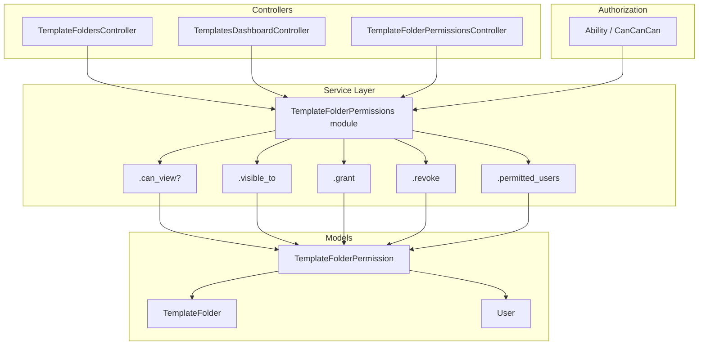
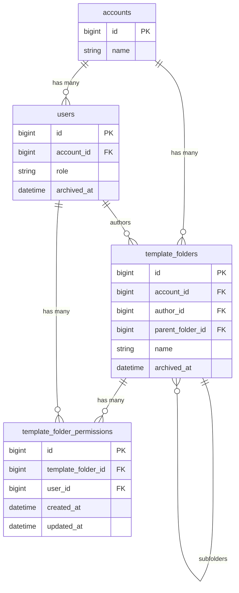

# Design Document: Folder View Permissions

## Overview

This document describes the technical design for adding view permissions to template folders in NexusSign. The feature introduces a `TemplateFolderPermission` join table and a `TemplateFolderPermissions` service module that enforces access control throughout the folder listing, individual folder access, and hierarchy traversal paths.

The design follows the existing `TemplateAccess` pattern already present in the codebase and integrates with CanCanCan's `load_and_authorize_resource` mechanism used in all folder controllers.

### Key Design Decisions

**Opt-in restriction model**: A folder with zero permission records is unrestricted — all account members can see it. A folder becomes restricted only when at least one `TemplateFolderPermission` record is created. This avoids a migration burden on existing folders and matches the mental model described in the requirements.

**No permission inheritance storage**: Hierarchy access is computed at query time by walking the ancestor chain, not by denormalizing permissions into child rows. This keeps the data model simple and avoids consistency problems when permissions change on a parent.

**Cascade via `dependent: :destroy`**: Both user deletion and folder deletion cascade through ActiveRecord associations, keeping the cleanup logic in the model layer rather than in callbacks or jobs.

---

## Architecture



The `TemplateFolderPermissions` module is the single source of truth for all permission logic. Controllers never query `TemplateFolderPermission` directly.

---

## Components and Interfaces

### 1. `TemplateFolderPermission` Model

A new ActiveRecord model backed by the `template_folder_permissions` join table.

```ruby
# app/models/template_folder_permission.rb
class TemplateFolderPermission < ApplicationRecord
  belongs_to :template_folder
  belongs_to :user

  validates :user_id, uniqueness: { scope: :template_folder_id }
  validate :user_and_folder_same_account

  private

  def user_and_folder_same_account
    return if user.nil? || template_folder.nil?
    return if user.account_id == template_folder.account_id

    errors.add(:user, 'must belong to the same account as the folder')
  end
end
```

### 2. `TemplateFolderPermissions` Service Module

Located at `lib/template_folder_permissions.rb`, mirroring the `TemplateFolders` module pattern.

```ruby
module TemplateFolderPermissions
  module_function

  # Returns true if the user may view this folder.
  # Rules (evaluated in order):
  #   1. Admin users always have access.
  #   2. The folder owner always has access.
  #   3. If the folder is unrestricted (no permission records), all account members have access.
  #   4. If the folder is restricted, the user must have an explicit permission record.
  #   5. Any ancestor in the hierarchy that is restricted and excludes the user blocks access.
  def can_view?(user, folder)
    return true if user.role == User::ADMIN_ROLE
    return true if folder.author_id == user.id
    return false if user.archived_at?

    # Walk ancestors from root to folder; deny if any ancestor blocks access
    ancestors = ancestor_chain(folder)
    ancestors.each do |ancestor|
      next if ancestor.id == folder.id
      return false unless node_accessible?(user, ancestor)
    end

    node_accessible?(user, folder)
  end

  # Returns an ActiveRecord relation of folders visible to the user.
  # Designed to be composed with other scopes (search, sort, pagination).
  def visible_to(folders_scope, user)
    return folders_scope if user.role == User::ADMIN_ROLE

    account_id = user.account_id

    # Folders owned by the user are always visible
    owned = folders_scope.where(author_id: user.id)

    # Unrestricted folders (no permission records) visible to all account members
    unrestricted = folders_scope.where(account_id:).where(
      'NOT EXISTS (SELECT 1 FROM template_folder_permissions WHERE template_folder_id = template_folders.id)'
    )

    # Restricted folders where the user has an explicit permission
    permitted = folders_scope.where(account_id:).joins(:template_folder_permissions)
                             .where(template_folder_permissions: { user_id: user.id })

    # Union the three sets, then filter out folders whose ancestors block access
    candidate_ids = TemplateFolder.from(
      owned.or(unrestricted).or(permitted).select(:id).distinct
    ).pluck(:id)

    # Remove candidates blocked by an inaccessible ancestor
    accessible_ids = candidate_ids.select { |id| can_view?(user, TemplateFolder.find(id)) }

    folders_scope.where(id: accessible_ids)
  end

  # Grants view permission. Idempotent — safe to call multiple times.
  # Raises ActiveRecord::RecordInvalid if the user is not in the same account.
  def grant(user, folder)
    TemplateFolderPermission.find_or_create_by!(user:, template_folder: folder)
  end

  # Revokes view permission. No-op if the record does not exist.
  def revoke(user, folder)
    TemplateFolderPermission.where(user:, template_folder: folder).destroy_all
  end

  # Returns the list of users who can view the folder.
  # For unrestricted folders, returns all active account users.
  # For restricted folders, returns owner + admins + explicitly permitted active users.
  def permitted_users(folder)
    account = folder.account
    active_users = account.users.active

    if restricted?(folder)
      explicit_user_ids = folder.template_folder_permissions.pluck(:user_id)
      active_users.where(
        'id IN (?) OR id = ? OR role = ?',
        explicit_user_ids,
        folder.author_id,
        User::ADMIN_ROLE
      )
    else
      active_users
    end
  end

  # Returns true if the folder has at least one permission record (is restricted).
  def restricted?(folder)
    folder.template_folder_permissions.exists?
  end

  private

  # Returns the ancestor chain from root down to (and including) the folder.
  def ancestor_chain(folder)
    chain = [folder]
    current = folder
    # Guard against cycles (should not occur with valid data)
    visited = Set.new([folder.id])

    while current.parent_folder_id
      current = current.parent_folder
      break if visited.include?(current.id)

      visited.add(current.id)
      chain.unshift(current)
    end

    chain
  end

  # Checks access for a single node, ignoring hierarchy.
  def node_accessible?(user, folder)
    return true if folder.author_id == user.id
    return true unless restricted?(folder)

    folder.template_folder_permissions.exists?(user_id: user.id)
  end
end
```

### 3. `TemplateFolderPermissionsController`

New controller for the grant/revoke API surface, nested under folders.

```ruby
# app/controllers/template_folder_permissions_controller.rb
class TemplateFolderPermissionsController < ApplicationController
  before_action :load_folder
  before_action :authorize_owner_or_admin

  # GET /folders/:folder_id/permissions
  def index
    @users = TemplateFolderPermissions.permitted_users(@template_folder)
    render json: @users.as_json(only: %i[id email first_name last_name role])
  end

  # POST /folders/:folder_id/permissions
  def create
    user = current_account.users.active.find(params[:user_id])
    TemplateFolderPermissions.grant(user, @template_folder)
    head :created
  rescue ActiveRecord::RecordNotFound
    render json: { error: 'User not found' }, status: :not_found
  rescue ActiveRecord::RecordInvalid => e
    render json: { error: e.message }, status: :unprocessable_entity
  end

  # DELETE /folders/:folder_id/permissions/:user_id
  def destroy
    user = current_account.users.find_by(id: params[:id])
    TemplateFolderPermissions.revoke(user, @template_folder) if user
    head :no_content
  end

  private

  def load_folder
    @template_folder = current_account.template_folders.find(params[:folder_id])
  end

  def authorize_owner_or_admin
    return if current_user.role == User::ADMIN_ROLE
    return if @template_folder.author_id == current_user.id

    raise CanCan::AccessDenied
  end
end
```

### 4. Changes to `TemplateFoldersController`

The `show` action loads subfolders. After this change, subfolders are filtered through `TemplateFolderPermissions.visible_to` before being returned.

```ruby
# In TemplateFoldersController#show, replace:
@template_folders =
  @template_folder.subfolders.where(id: Template.accessible_by(current_ability).active.select(:folder_id))

# With:
raw_subfolders = @template_folder.subfolders
                                 .where(id: Template.accessible_by(current_ability).active.select(:folder_id))
@template_folders = TemplateFolderPermissions.visible_to(raw_subfolders, current_user)
```

### 5. Changes to `TemplatesDashboardController`

The `@template_folders` relation loaded by `load_and_authorize_resource` is further filtered through `visible_to` before being passed to `TemplateFolders.filter_active_folders`.

```ruby
# In TemplatesDashboardController#index, replace:
@template_folders =
  TemplateFolders.filter_active_folders(@template_folders.where(parent_folder_id: nil), @templates)

# With:
permitted_folders = TemplateFolderPermissions.visible_to(
  @template_folders.where(parent_folder_id: nil),
  current_user
)
@template_folders = TemplateFolders.filter_active_folders(permitted_folders, @templates)
```

### 6. Changes to `Ability`

The existing CanCanCan rules grant broad `read` / `manage` access to `TemplateFolder` by `account_id`. These remain in place as the first gate (account membership). The `TemplateFolderPermissions` service provides the second, finer-grained gate. This two-layer approach avoids rewriting CanCanCan conditions with complex SQL.

For the `TemplateFolderPermissionsController`, a new ability is added:

```ruby
# In Ability#initialize, for editor and admin roles:
can :manage, TemplateFolderPermission, template_folder: { account_id: user.account_id,
                                                          author_id: user.id }
# Admins already have :manage :all, so no change needed for admin.
```

---

## Data Models

### New Table: `template_folder_permissions`

```ruby
# db/migrate/YYYYMMDDHHMMSS_create_template_folder_permissions.rb
class CreateTemplateFolderPermissions < ActiveRecord::Migration[8.0]
  def change
    create_table :template_folder_permissions do |t|
      t.references :template_folder, null: false, foreign_key: true, index: false
      t.references :user,            null: false, foreign_key: false, index: false

      t.index %i[template_folder_id user_id], unique: true, name: 'idx_tfp_on_folder_and_user'

      t.timestamps
    end
  end
end
```

**Design notes:**
- `foreign_key: false` on `user_id` mirrors the `template_accesses` pattern, allowing the application layer to handle user deletion cleanup rather than relying on DB-level cascade (which would conflict with soft-delete / archival semantics).
- The composite unique index on `(template_folder_id, user_id)` enforces the no-duplicate-permissions invariant at the database level.
- No `account_id` denormalization — account membership is validated through the model's cross-account validation.

### Updated `TemplateFolder` Model

```ruby
has_many :template_folder_permissions, dependent: :destroy
has_many :permitted_users, through: :template_folder_permissions, source: :user
```

`dependent: :destroy` on `template_folder_permissions` handles Requirement 8.1 and 8.4 automatically: when a folder is destroyed, ActiveRecord cascades to its `template_folder_permissions`, and because `subfolders` also has `dependent: :destroy`, the entire subtree's permissions are cleaned up recursively.

### Updated `User` Model

```ruby
has_many :template_folder_permissions, dependent: :destroy
```

`dependent: :destroy` handles Requirement 7.1: deleting a user removes all their permission records.

### Entity Relationship Diagram



---

## Correctness Properties

*A property is a characteristic or behavior that should hold true across all valid executions of a system — essentially, a formal statement about what the system should do. Properties serve as the bridge between human-readable specifications and machine-verifiable correctness guarantees.*

### Property 1: Permission grant creates a record

*For any* active user and template folder belonging to the same account, calling `TemplateFolderPermissions.grant(user, folder)` shall result in exactly one `TemplateFolderPermission` record linking that user to that folder, regardless of how many times grant is called.

**Validates: Requirements 1.1, 1.2**

---

### Property 2: Cross-account grant is rejected

*For any* user from account A and folder from account B (where A ≠ B), calling `TemplateFolderPermissions.grant(user, folder)` shall raise an error and create no permission record.

**Validates: Requirements 1.3, 10.3**

---

### Property 3: Permission revoke is idempotent

*For any* user and folder, calling `TemplateFolderPermissions.revoke(user, folder)` shall leave zero permission records for that pair, whether or not a record existed before the call, and shall not raise an error.

**Validates: Requirements 2.1, 2.4**

---

### Property 4: Owner always has view access

*For any* template folder, `TemplateFolderPermissions.can_view?(folder.author, folder)` shall return `true`, regardless of whether the folder is restricted or unrestricted.

**Validates: Requirements 3.1, 5.1**

---

### Property 5: Explicit permission grants view access

*For any* user and restricted folder where a `TemplateFolderPermission` record exists for that user-folder pair, `TemplateFolderPermissions.can_view?(user, folder)` shall return `true`.

**Validates: Requirements 3.2, 5.5**

---

### Property 6: Unrestricted folders are visible to all account members

*For any* template folder with zero permission records and any active user in the same account, `TemplateFolderPermissions.can_view?(user, folder)` shall return `true`.

**Validates: Requirements 3.3, 5.3**

---

### Property 7: Restricted folders deny unpermitted users

*For any* template folder with at least one permission record, and any active user who is neither the folder owner, an admin, nor holds an explicit permission for that folder, `TemplateFolderPermissions.can_view?(user, folder)` shall return `false`.

**Validates: Requirements 3.4, 5.2**

---

### Property 8: Admin users always have view access

*For any* template folder and any user with `role == 'admin'` in the same account, `TemplateFolderPermissions.can_view?(user, folder)` shall return `true`.

**Validates: Requirements 3.5, 5.4**

---

### Property 9: Folder listing returns only accessible folders

*For any* user and any collection of template folders in the same account, `TemplateFolderPermissions.visible_to(folders, user)` shall return exactly the subset of folders for which `can_view?(user, folder)` is `true`.

**Validates: Requirements 4.1, 4.2, 4.3, 4.4, 4.5**

---

### Property 10: Ancestor access grants descendant access

*For any* folder hierarchy of arbitrary depth, if a user has view access to a parent folder, then `TemplateFolderPermissions.can_view?(user, subfolder)` shall return `true` for every subfolder in that parent's subtree (assuming the subfolders themselves are not independently restricted in a way that would block the user).

**Validates: Requirements 6.1**

---

### Property 11: Blocked ancestor denies all descendants

*For any* folder hierarchy of arbitrary depth, if a user lacks view access to any ancestor folder (the ancestor is restricted and the user has no permission for it), then `TemplateFolderPermissions.can_view?(user, descendant)` shall return `false` for every descendant of that ancestor, regardless of any explicit permissions the user may hold on the descendant.

**Validates: Requirements 6.2, 6.3, 6.5**

---

### Property 12: User deletion cascades all permission records

*For any* user with N permission records across M folders, destroying that user shall result in zero `TemplateFolderPermission` records with that `user_id` remaining in the database.

**Validates: Requirements 7.1**

---

### Property 13: Archived users are denied access to restricted folders

*For any* archived user (non-nil `archived_at`) and any restricted folder, `TemplateFolderPermissions.can_view?(user, folder)` shall return `false`, even if an explicit permission record exists for that user.

**Validates: Requirements 7.2**

---

### Property 14: Folder deletion cascades all permission records

*For any* folder hierarchy with permission records at multiple levels, destroying the root folder shall result in zero `TemplateFolderPermission` records for any folder in that subtree.

**Validates: Requirements 8.1, 8.4**

---

### Property 15: Permitted users query round-trip

*For any* restricted folder with N explicit permission records for active users, `TemplateFolderPermissions.permitted_users(folder)` shall include exactly those N users (plus the owner and all admins), and shall exclude any archived users even if they hold a permission record.

**Validates: Requirements 9.1, 9.2, 9.3, 9.5**

---

### Property 16: Unrestricted folder returns all active account users

*For any* unrestricted folder (zero permission records) in an account with M active users, `TemplateFolderPermissions.permitted_users(folder)` shall return all M active users.

**Validates: Requirements 9.4**

---

## Error Handling

### Cross-account permission attempt

`TemplateFolderPermission` validates that user and folder share the same `account_id`. The model raises `ActiveRecord::RecordInvalid` with a descriptive message. The controller catches this and returns HTTP 422 with a JSON error body.

### Folder not found

`load_folder` in `TemplateFolderPermissionsController` uses `find`, which raises `ActiveRecord::RecordNotFound`. Rails' default rescue renders a 404. No special handling needed.

### Unauthorized permission management

Non-owner, non-admin users attempting to manage permissions hit the `authorize_owner_or_admin` before-action, which raises `CanCan::AccessDenied`. The existing `rescue_from` in `ApplicationController` redirects to root with an alert.

### Hierarchy cycle guard

`ancestor_chain` in the service module tracks visited IDs in a `Set` and breaks if a cycle is detected. This is a defensive guard; cycles cannot occur with valid FK constraints but protects against data corruption.

### Archived folder access

Archived folders (`archived_at` is non-nil) are excluded from the `TemplateFolder.active` scope used in all listing queries. The `can_view?` method does not special-case archived folders — they simply won't appear in listings. Direct access to an archived folder's show page is governed by the existing `archived_at` checks in the controller.

---

## Testing Strategy

The project uses RSpec with FactoryBot and Faker. Property-based testing will use the **`rantly`** gem, which integrates naturally with RSpec and supports arbitrary data generation without requiring a separate test runner.

Add to `Gemfile` (test group):
```ruby
gem 'rantly'
```

### Unit Tests (example-based)

Located in `spec/lib/template_folder_permissions_spec.rb` and `spec/models/template_folder_permission_spec.rb`.

Cover:
- Model validations (cross-account rejection, uniqueness constraint)
- `grant` / `revoke` with concrete user-folder pairs
- `can_view?` for each access rule with specific examples
- `permitted_users` for restricted and unrestricted folders
- Archived user exclusion from `permitted_users`

### Property-Based Tests

Located in `spec/lib/template_folder_permissions_property_spec.rb`.

Each property test runs a minimum of **100 iterations** via Rantly's `property_of`. Tests are tagged with the design property they validate.

```ruby
# Example structure
RSpec.describe TemplateFolderPermissions, :property do
  # Feature: folder-view-permissions, Property 1: Permission grant creates a record
  it 'grant is idempotent and creates exactly one record' do
    property_of {
      account  = create(:account)
      user     = create(:user, account:)
      folder   = create(:template_folder, account:)
      integer(1..5)  # number of grant calls
    }.check(100) do |n|
      # call grant n times, verify count == 1
    end
  end
end
```

Full property test implementations map to Properties 1–16 above.

### Controller / Integration Tests

Located in `spec/requests/template_folder_permissions_spec.rb`.

Cover:
- `GET /folders/:id/permissions` — returns correct user list
- `POST /folders/:id/permissions` — creates record, rejects cross-account
- `DELETE /folders/:id/permissions/:user_id` — removes record, no-op on missing
- Authorization: non-owner/non-admin gets 403

### Factory Additions

```ruby
# spec/factories/template_folder_permissions.rb
FactoryBot.define do
  factory :template_folder_permission do
    template_folder
    user
  end
end
```

### Test Coverage Targets

| Area | Type | Properties Covered |
|---|---|---|
| `TemplateFolderPermission` model | Unit | 1, 2 |
| `can_view?` logic | Property | 4–8, 10–11, 13 |
| `visible_to` scope | Property | 9 |
| `grant` / `revoke` | Property | 1–3 |
| `permitted_users` | Property | 15–16 |
| Cascade deletion | Property | 12, 14 |
| Controller endpoints | Integration | 1, 2, 3 |
